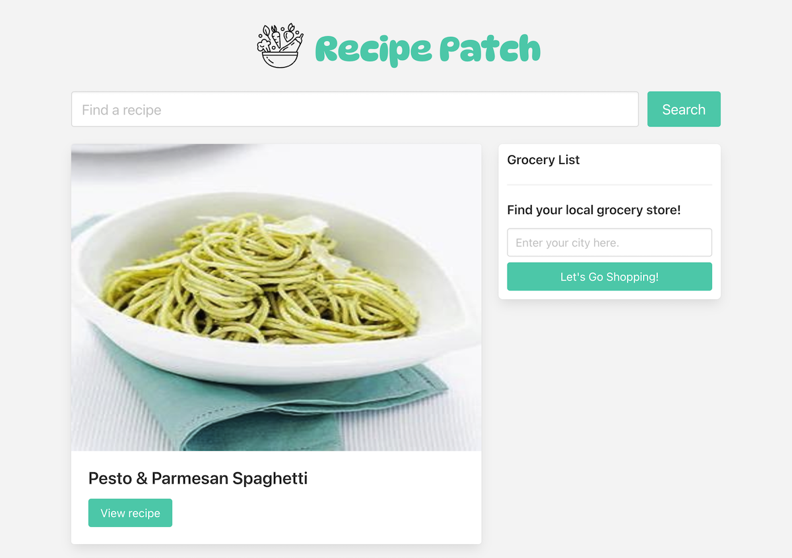
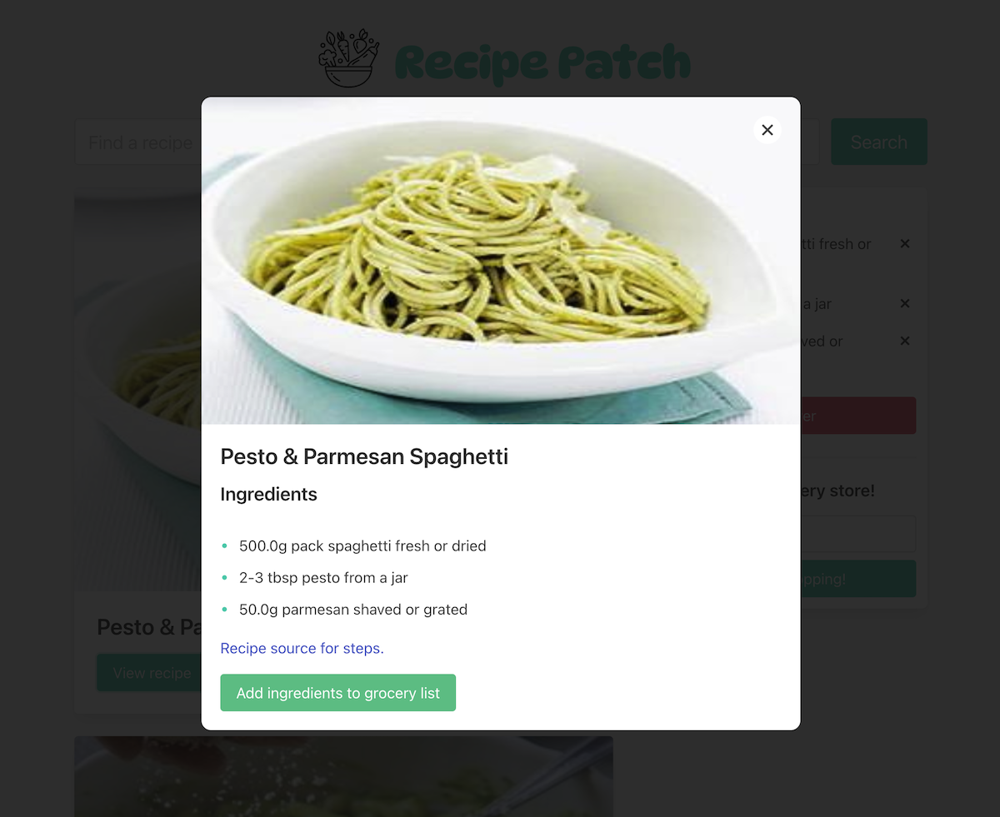
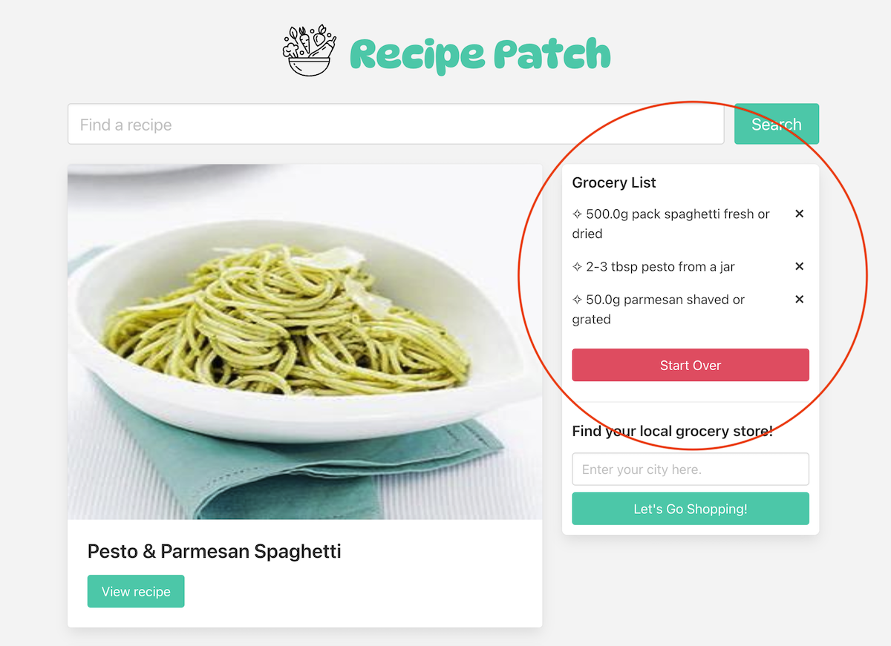
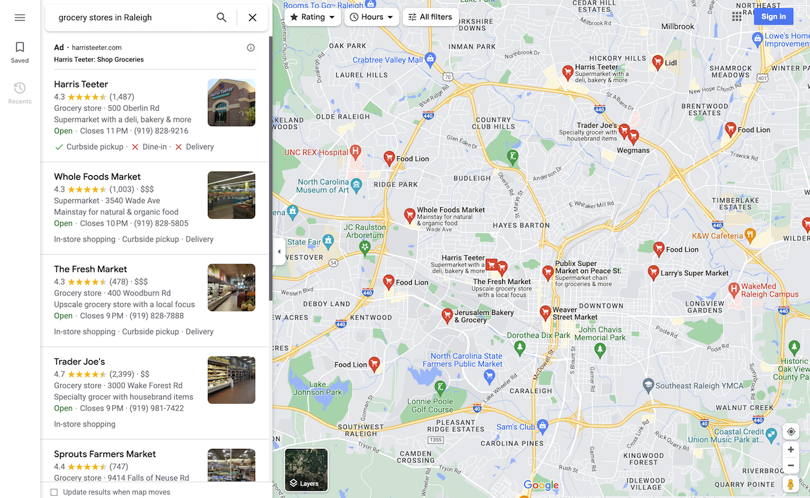

# Recipe Patch

## Description

Introducing recipe patch, the ultimate resource for food lovers and cooks.

We help you discover new and delicious recipes, and make the cooking process easier by providing recommendations where to find the ingredients you will need and a shopping list to keep track of those ingredients.

Whether you're a seasoned chef or a novice in the kitchen, recipe patch is your go-to app for inspiration and convenience.

## Installation

N/A

## Usage

Visit the site [here](https://skywalkah.github.io/recipe-patch/). And follow these steps:

1. Search for a recipe by typing the name of it or an ingredient, click "Search" or press "Enter".
2. Look through recipes and find one you like. Click the "View recipe" button.
3. Scroll to the bottom and click the "Add Ingredients to grocery list" button.
4. The ingredients were added to the Grocery list on the top. You can now delete some of them, start over, or enter your city and find your nearest grocery store.
5. Go shopping!

## What it should look like

## Credits

Logo .svg image: [The Noun Project](https://thenounproject.com/icon/vegetables-1422990/), [Wikimedia](https://meta.wikimedia.org/wiki/File:Noun_Project_vegetables_icon_1422990_cc.svg)

Devs: [anicrob](https://github.com/anicrob) [myflash1990](https://github.com/myflash1990) [Roadglide131](https://github.com/Roadglide131) [skywalkah](https://github.com/skywalkah)

Framework: [Bulma](https://bulma.io/)

APIs: [Edaman](https://www.edamam.com/) [Geoapify](https://www.geoapify.com/)

## License

MIT license - Please refer to the LICENSE in the repo for more info.
